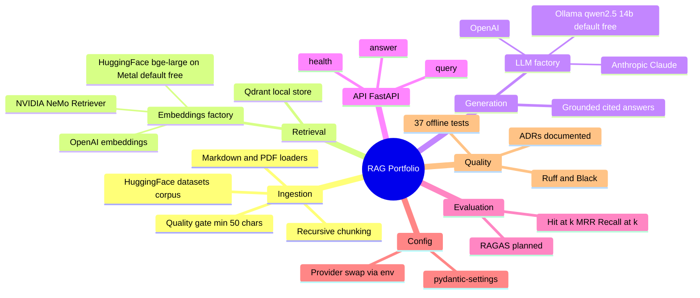

# RAG Portfolio — LLM Cost, Latency & GPU Optimization

A production-minded **Retrieval-Augmented Generation** system over a curated
corpus of LLM inference-optimization material — PagedAttention, continuous
batching, quantization, speculative decoding, KV-cache management, and tensor
parallelism.

The stack is **free to run locally** (local embeddings + local LLM) and
**provider-swappable by configuration**: switch embeddings or the LLM to NVIDIA,
OpenAI, or Anthropic with a single environment variable — no code change.

## Mindmap



## Features

- **Ingestion with a quality gate** — loads Markdown/PDF, chunks deterministically,
  strips excessive whitespace, drops sub-50-character chunks, and logs
  processed/accepted/rejected counts.
- **Provider-agnostic embeddings and LLM** — one config value selects the backend
  behind a factory; integration packages are imported lazily.
- **Real corpus from Hugging Face** — streams + filters `CShorten/ML-ArXiv-Papers`
  to the inference-optimization domain; indexes on Apple Metal (MPS).
- **Vector retrieval** over Qdrant with top-k similarity search.
- **Grounded generation** — answers cite the source documents they used.
- **HTTP API** (FastAPI): `/health`, `POST /api/v1/query`, `POST /api/v1/answer`.
- **Hybrid retrieval + reranking** — optional BM25 + dense fusion and
  cross-encoder reranking, evaluated on real ground truth (see
  [docs/experiments.md](docs/experiments.md)).
- **Evaluation harness** — deterministic Hit@k / MRR / Recall@k over a gold set.
- **Tested** — 37 offline tests (mocked embeddings + LLM), Ruff-clean.

## Quickstart

Prerequisites: Python 3.13, [uv](https://docs.astral.sh/uv/), and
[Ollama](https://ollama.com) for local generation.

```bash
uv sync
ollama pull qwen2.5:14b              # one-time, ~9 GB (default LLM)

# Retrieval only
uv run python -m src.pipeline --query "How does paged attention manage the KV cache?"

# Full RAG (retrieve + generate)
uv run python -m src.generation.rag --query "Why does continuous batching improve throughput?"

# Evaluate retrieval quality
uv run python -m src.evaluation.retrieval_eval

# Run the API
uv run uvicorn src.api.main:app --reload
curl -X POST localhost:8000/api/v1/answer \
  -H 'content-type: application/json' \
  -d '{"text":"What is speculative decoding?"}'
```

## Architecture

See **[docs/architecture.md](docs/architecture.md)** for the full end-to-end
workflow diagram, a request sequence diagram, and a component breakdown. Design
decisions and their trade-offs live in **[docs/decisions.md](docs/decisions.md)**.

## Tech stack

| Layer | Choice |
|---|---|
| Language / tooling | Python 3.13, uv, Ruff, Black, pytest |
| Framework | LangChain |
| Vector DB | Qdrant (local / in-memory) |
| Embeddings | HuggingFace `bge-large` on Apple MPS (default) — swappable |
| LLM | Ollama `qwen2.5:14b` on M4 (default) — swappable |
| Corpus | `data/sample/` + HF `CShorten/ML-ArXiv-Papers` (filtered) |
| API | FastAPI + Uvicorn |

## Project status

- ✅ **Phase 1 — Foundation:** ingestion, retrieval, generation, API (end-to-end working)
- 🚧 **Phase 2 — Quality:** evaluation harness (done) → hybrid search + reranking, RAGAS, ablations
- ⬜ **Phase 3 — Ship:** frontend, Docker, CI/CD, deployment

## Tests

```bash
uv run pytest
uv run ruff check src tests
```
