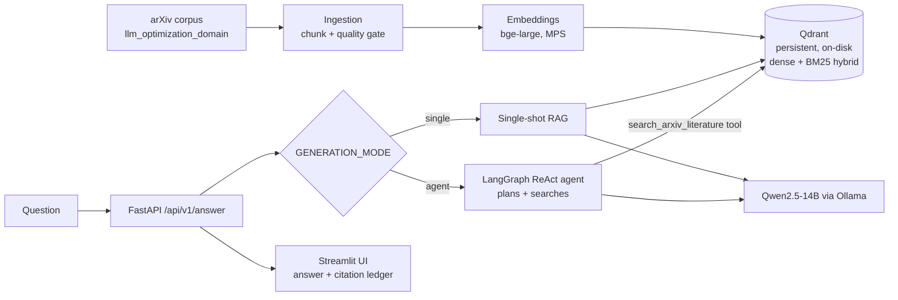

# Autonomous Inference Optimization RAG System

A production-minded Retrieval-Augmented Generation system that answers questions
about **LLM inference optimization** (vLLM, quantization, KV-cache, continuous
batching, speculative decoding) over a curated arXiv corpus — with an autonomous
agent that plans and actively searches, every claim traced to its source.

Runs **fully local and free** (local embeddings + a local LLM); every provider is
swappable to a hosted API by changing one config value.

**Stack:** LangGraph (ReAct agent) · Qwen2.5-14B (Ollama) · FastAPI · Qdrant ·
HuggingFace `bge-large` · Streamlit · Docker · RAGAS + Weights & Biases

---

## Why this project

It demonstrates end-to-end ML-engineering judgment, not a toy demo:

- **Measured retrieval, not vibes.** A 300-question ablation (dense vs. hybrid
  vs. reranked) with reproducible numbers, plus local RAGAS generation metrics.
- **Honest engineering.** A live test caught a failing agent framework; the fix
  (and the reasoning) is documented as an ADR rather than hidden.
- **Provider-agnostic by design.** Free local-first default, one-line swap to
  NVIDIA / OpenAI / Anthropic — built for the "when funded" upgrade path.
- **Actually ships.** Multi-stage Docker, docker-compose, and CI; verified with a
  live containerized integration test against host-native Ollama.

---

## Results (real, reproducible numbers)

### Retrieval ablation — `rag-mini-wikipedia`, 300 factoid QA (answer-recall@k)

| Config | Hit@5 | MRR | Recall@5 |
|---|---|---|---|
| Dense (`bge-large`) | 0.697 | 0.594 | 0.487 |
| **+ Hybrid (BM25)** | **0.717** | **0.639** | **0.496** |
| + Hybrid + Rerank | 0.690 | 0.520 | 0.470 |

**Hybrid wins** (+0.045 MRR): BM25's exact-term matching catches the
entity/number questions dense embeddings blur. **Reranking hurt on this metric**
— a documented objective/metric mismatch (the cross-encoder optimizes semantic
relevance; the proxy rewards answer-string presence), not a code defect. See
[docs/experiments.md](docs/experiments.md).

### Generation eval — RAGAS, fully local judge (`qwen2.5:14b`)

| Metric | Score |
|---|---|
| faithfulness | 0.48 |
| answer_relevancy | 0.65 |

Real local-judge numbers over the on-domain arXiv corpus. The loop is
**NaN-tolerant** with a hosted-judge fallback (`RAGAS_JUDGE_PROVIDER`) for
cleaner numbers without making the app depend on a paid API — see
[ADR-016](docs/decisions.md).

---

## Architecture



- **Ingestion** streams a 500-paper arXiv slice into ~1,477 chunks behind a
  quality gate (min length, whitespace normalization).
- **Retrieval** is `bge-large` dense + optional BM25 hybrid + optional
  cross-encoder rerank, over a **persistent on-disk Qdrant** collection
  (`llm_optimization_domain`) — seeded once, reused across runs.
- **Generation** is config-gated (`GENERATION_MODE`): a RAGAS-measured
  single-shot baseline (default), or a **LangGraph ReAct agent** that decides
  when to search and cites what it used.

Full workflow + sequence diagrams: [docs/architecture.md](docs/architecture.md).

### Key decision: deepagents → LangGraph ReAct ([ADR-018](docs/decisions.md))

The agent was first built on `deepagents`. A live smoke test showed its heavy
built-in middleware overwhelmed the local 14B model — it never called the search
tool and hallucinated off-topic output. A control test confirmed the same model
calls tools reliably in a lighter harness, so I migrated to LangGraph's
`create_react_agent`. This preserved the **local-first, privacy-preserving**
constraint (no hosted model required for the agent to work). All architecture
decisions live in [docs/decisions.md](docs/decisions.md).

---

## Run it locally

**Prerequisites:** Docker Desktop, [Ollama](https://ollama.com), and
[uv](https://docs.astral.sh/uv/) (for the one-time corpus seed).

```bash
# 1. Pull the local LLM (served by host Ollama)
ollama pull qwen2.5:14b

# 2. Install deps and seed the persistent Qdrant corpus (one-time, ~70s)
uv sync
uv run python -m scripts.seed_arxiv_db

# 3. Launch the stack
docker compose up
```

- **UI:** http://localhost:8501
- **API:** http://localhost:8000 — `POST /api/v1/answer` `{"text": "...", "top_k": 5}`

The backend reaches host Ollama via `host.docker.internal:11434` and mounts the
seeded `./.qdrant_storage` as a volume (no re-ingestion on startup). To use the
autonomous agent path, set `GENERATION_MODE=agent` on the backend service.

### Example

```bash
curl -s -X POST http://localhost:8000/api/v1/answer \
  -H 'Content-Type: application/json' \
  -d '{"text":"How does continuous batching improve GPU throughput?","top_k":5}'
```

Returns the synthesized answer plus the arXiv sources (title + id) it used.

---

## Development

```bash
uv sync                       # install (incl. dev deps)
uv run ruff check .           # lint
uv run pytest -q              # full test suite (offline; external calls mocked)
```

Evaluation and tracking:

```bash
uv run python -m scripts.run_ragas_sample                      # local RAGAS metrics
ENABLE_WANDB=true uv run python -m scripts.run_ragas_sample    # log to Weights & Biases
```

---

## Terminal-native infrastructure & CI/CD

The cloud path is driven entirely from the terminal — no dashboard click-ops:

```bash
scripts/provision_qdrant.sh   # guided qcloud free-tier cluster + app key -> .env.cloud
scripts/deploy_render.sh      # validate render.yaml, push the Blueprint (GitOps auto-deploy)
uv run python scripts/verify_prod.py https://<backend>.onrender.com
```

- **`provision_qdrant.sh`** — prints the exact `qcloud` commands to stand up a
  free-tier Qdrant Cloud cluster and shows where to paste the URL/key.
- **`deploy_render.sh`** — validates `render.yaml` locally, then `git push`es so
  Render syncs the Blueprint. (Heads-up: the npm `render` template tool is *not*
  the Render.com CLI — install `render-oss`.)
- **`verify_prod.py`** — post-deploy smoke test: hits `/health`, then
  `POST /api/v1/answer`, and **fails loudly unless the response carries both an
  answer and sources** — proving Qdrant Cloud and the hosted LLM are wired
  together.
- **CI** ([`.github/workflows/ci.yml`](.github/workflows/ci.yml)) runs
  `ruff check .` plus the full pytest suite on every push/PR to `main`.

Local runs fall back to the on-disk `./.qdrant_storage`; setting
`QDRANT_CLOUD_URL` + `QDRANT_API_KEY` (see [`.env.cloud.example`](.env.cloud.example))
flips retrieval to Qdrant Cloud with no code change.

---

## Project layout

```
src/
  ingestion/     corpus loaders + quality gate
  retrieval/     embeddings factory, Qdrant engine (dense/hybrid/rerank)
  generation/    single-shot RAG, LangGraph ReAct agent, mode dispatcher
  evaluation/    RAGAS generation eval + W&B tracking
  api/           FastAPI app (/health, /api/v1/query, /api/v1/answer)
  frontend/      Streamlit UI (answer + citation ledger)
scripts/         seed DB, run RAGAS, provision Qdrant, deploy Render, verify prod
docs/            ADRs (decisions.md), experiments.md, architecture.md, roadmap.md
```

## Tech stack

| Layer | Choice |
|---|---|
| Agent | LangGraph `create_react_agent` |
| LLM | Qwen2.5-14B via Ollama (swappable: Anthropic / OpenAI) |
| Embeddings | HuggingFace `bge-large-en-v1.5` (swappable: NVIDIA / OpenAI) |
| Vector DB | Qdrant (persistent on-disk; dense + BM25 hybrid) |
| API | FastAPI |
| UI | Streamlit |
| Eval | RAGAS (local judge) + Weights & Biases |
| Packaging | uv, multi-stage Docker, docker-compose, GitHub Actions CI |
