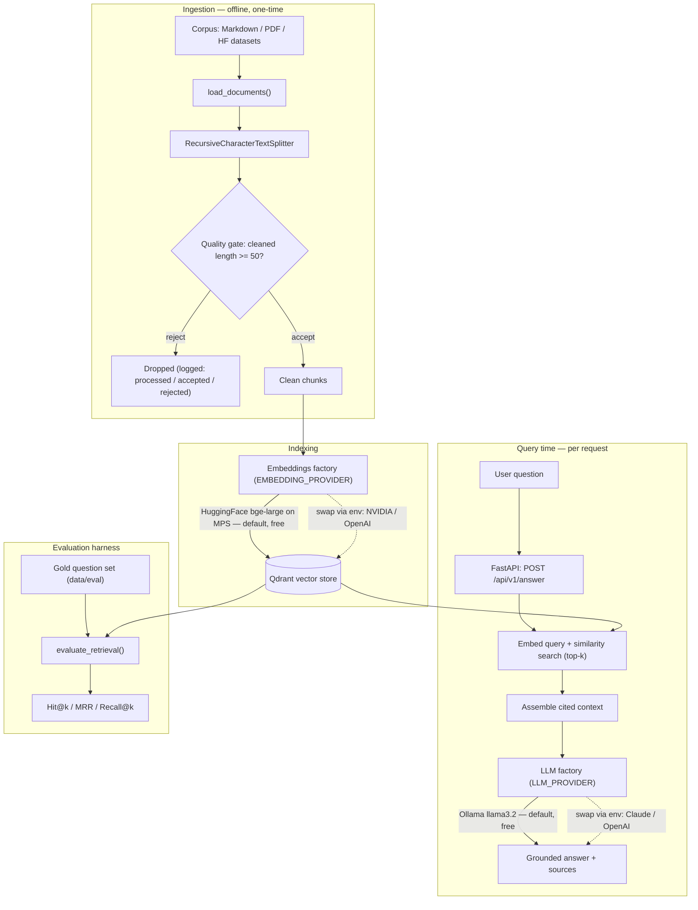
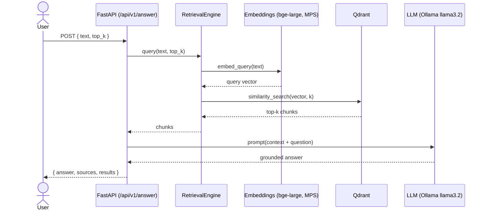

# Architecture

The system has two execution paths — an **indexing** path (offline, one-time per
corpus) and a **query** path (per request) — plus an **evaluation** harness that
measures retrieval quality against a gold set. Embeddings and the LLM are chosen
by configuration behind factories, so providers are swappable without code
changes.

## End-to-end workflow

## Request lifecycle: `POST /api/v1/answer`

## Components

| Module | Responsibility |
|---|---|
| `src/config/settings.py` | Pydantic settings: provider selection, model ids, API keys, Qdrant + corpus config (from `.env`). |
| `src/ingestion/loader.py` | Load Markdown/PDF, recursive chunking, quality gate with logging. |
| `src/retrieval/embeddings.py` | Embeddings provider factory (HuggingFace / NVIDIA / OpenAI), lazy imports. |
| `src/retrieval/engine.py` | `RetrievalEngine` over Qdrant: `index()` and `query()`; `build_engine()` wires config. |
| `src/generation/llm.py` | LLM provider factory (Ollama / Anthropic / OpenAI), lazy imports. |
| `src/generation/rag.py` | `answer_question()`: retrieve context, then generate a grounded, source-cited answer. |
| `src/api/main.py` | FastAPI app: `/health`, `/api/v1/query`, `/api/v1/answer`; lazy engine/LLM; corpus auto-indexed on first use. |
| `src/evaluation/` | Deterministic metrics (Hit@k, MRR, Recall@k) + `evaluate_retrieval()` harness. |
| `src/pipeline.py` | Retrieval CLI tying ingestion → indexing → query. |

## Provider swappability

Both embeddings and the LLM are selected by a single environment variable and
built behind a factory. The default stack is fully local and free; switching to a
hosted provider is a config change, not a code change.

| Concern | Env var | Default (free) | Swap options |
|---|---|---|---|
| Embeddings | `EMBEDDING_PROVIDER` | `huggingface` (`bge-large`, MPS) | `nvidia`, `openai` |
| LLM | `LLM_PROVIDER` | `ollama` (`llama3.2`) | `anthropic`, `openai` |

> Note: embedding providers emit different vector dimensions, so switching the
> embedding provider requires re-indexing the corpus into a fresh collection.
